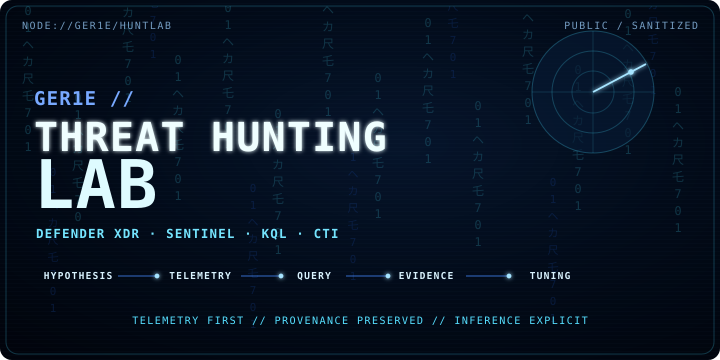

<p align="center">
  
</p>

<div align="center">

<strong>THREAT HUNTING LAB</strong><br/>
<sub>Sanitized Defender XDR / Sentinel hunts · CTI translation · evidence-first investigation</sub><br/>

<a href="https://github.com/ger1e/threat-hunting-lab/actions/workflows/hunt-contract.yml"></a>

</div>

<p align="center"><sub>
  <a href="https://github.com/ger1e">PROFILE</a> ·
  <a href="https://gergoilly.hu/">SITE</a> ·
  <a href="docs/HUNTING-METHODOLOGY.md">METHODOLOGY</a> ·
  <a href="docs/CTI-NORMALIZATION.md">CTI NORMALIZATION</a> ·
  <a href="CONTRIBUTING.md">CONTRIBUTE</a>
</sub></p>

A sanitized public implementation of how I structure threat hunting, CTI translation, telemetry-readiness checks, evidence handling, and detection-oriented investigation. The repository demonstrates method and engineering discipline; the included KQL files are examples, not a ranked list of real-world hunting priorities.

<sub><strong>STATUS</strong> — public / sanitized<br/>
<strong>MODEL</strong> — hypothesis → telemetry → query → evidence → tuning<br/>
<strong>PLATFORM</strong> — Microsoft Defender XDR / Sentinel<br/>
<strong>LANGUAGE</strong> — KQL<br/>
<strong>PRIORITY</strong> — behavior + context + evidence</sub>

<sub><strong>01 // OPERATING MODEL</strong></sub>

[`Hunting methodology`](docs/HUNTING-METHODOLOGY.md) defines the complete lifecycle from intake and falsifiable hypothesis through telemetry readiness, evidence grading, false-positive analysis, tuning, detection promotion, gap recording, and retirement.

[`CTI normalization`](docs/CTI-NORMALIZATION.md) defines the provenance model used when external intelligence is translated into observations, enrichment, correlation, hunt hypotheses, and confidence judgments.

```text
INTELLIGENCE / INCIDENT / COVERAGE GAP
                ↓
            HYPOTHESIS
                ↓
        TELEMETRY READINESS
                ↓
             QUERY
                ↓
       EVIDENCE + CONTEXT
                ↓
      TUNING / CORRELATION
                ↓
FINDING / DETECTION / GAP / KNOWLEDGE
```

<sub><strong>02 // REPOSITORY CONTRACT</strong></sub>

Every public hunt should answer these before the first operator runs:

1. What falsifiable behavior is being tested?
2. Which telemetry must exist for the query to mean anything?
3. What ATT&CK behavior is relevant, and what is merely adjacent?
4. What should an analyst inspect in the returned rows?
5. Which legitimate behaviors are expected to collide with the signal?
6. How should the query be tuned without deleting the behavior being hunted?
7. What conclusion is justified if the query returns nothing?

<sub>Each `.kql` file carries: `Title` · `Description` · `Suspicious Behavior` · `MITRE ATT&CK` · `Pyramid of Pain` · `Kill Chain` · `Relevant CTI`. CI rejects hunts that drop this context.</sub>

<sub><strong>03 // CTI NORMALIZATION</strong></sub>

[`cti-schema.json`](cti-schema.json) is the compact machine-readable normalization contract. It separates source/provenance, observable value/type, actor or campaign context, confidence, temporal fields, and ingestion metadata so enrichment does not erase where evidence came from.

<sub><strong>SOURCE</strong> → PROVENANCE → CLAIM → RELEVANCE → OBSERVABLE BEHAVIOR<br/>
<strong>OBSERVABLE</strong> → TELEMETRY → HYPOTHESIS → EVIDENCE → CONFIDENCE</sub>

Repeated reporting is not automatically independent corroboration. Provenance is preserved through enrichment and correlation.

<sub><strong>04 // PUBLIC EXAMPLES</strong></sub>

The query files below are intentionally small, sanitized examples rather than a portfolio ranking or representation of operational hunt volume.

- [`device-code-follow-on.kql`](hunts/device-code-follow-on.kql) — OAuth device-code authentication requiring contextual investigation · `AADSignInEventsBeta`
- [`rare-outbound-beaconing.kql`](hunts/rare-outbound-beaconing.kql) — low-volume periodic outbound behavior · `DeviceNetworkEvents`
- [`suspicious-powershell-encoded-command.kql`](hunts/suspicious-powershell-encoded-command.kql) — encoded / obfuscated PowerShell execution · `DeviceProcessEvents`

<sub><strong>05 // QUALITY GATES</strong></sub>

- Falsifiable hypothesis before query construction.
- Telemetry availability, coverage, semantics, retention, latency, and fidelity checked before interpretation.
- Cheap filters and early aggregation preferred where they preserve investigation value.
- Observed evidence separated from inference and attribution.
- Expected false positives and tuning guidance documented.
- CTI source URLs and provenance preserved.
- Negative results scoped to the telemetry actually available.
- Public-safety review before contribution or release.

<sub><strong>06 // CONTRIBUTION · SAFETY · LICENSE</strong></sub>

See [`CONTRIBUTING.md`](CONTRIBUTING.md). Pull requests use a hunt-focused template that forces telemetry assumptions, analyst value, ATT&CK scope, false-positive analysis, provenance, and a public-safety check into the review path. Repository ownership is explicit in [`.github/CODEOWNERS`](.github/CODEOWNERS).

This repository is intentionally sanitized. Do not submit customer telemetry, real internal hostnames, tenant identifiers, private infrastructure, credentials, unpublished incident evidence, proprietary rules, or material that cannot be safely made public. See [`SECURITY.md`](SECURITY.md) for disclosure guidance and scope.

<sub>MIT. See [`LICENSE`](LICENSE). The license covers the public example material in this repository; third-party names, trademarks, and linked intelligence sources remain the property of their respective owners.</sub>
